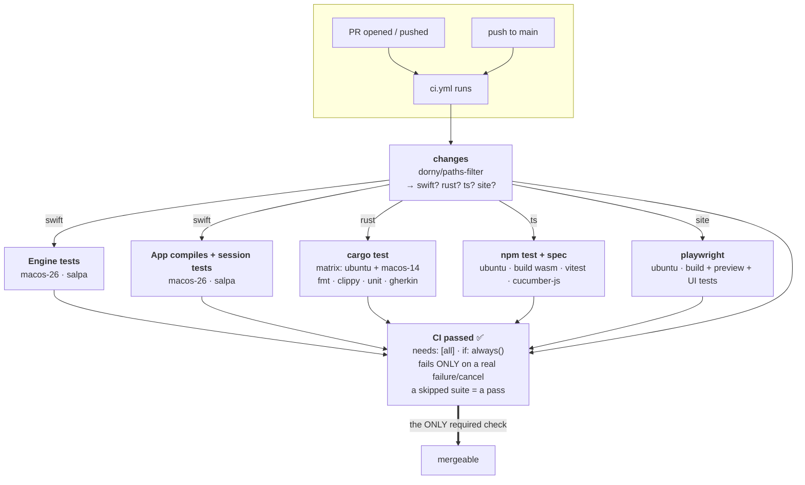
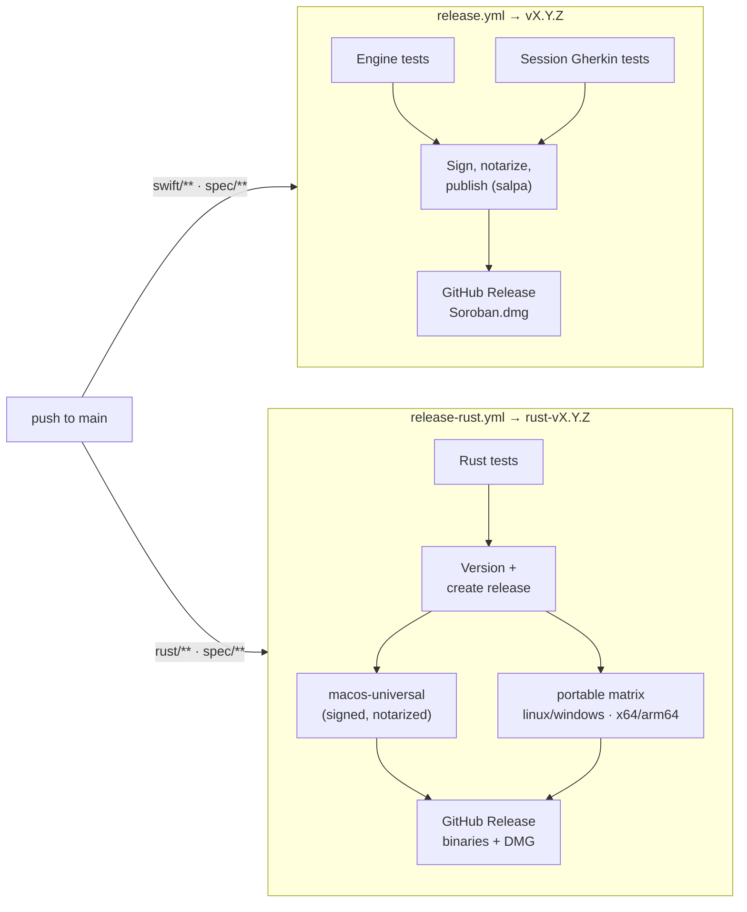
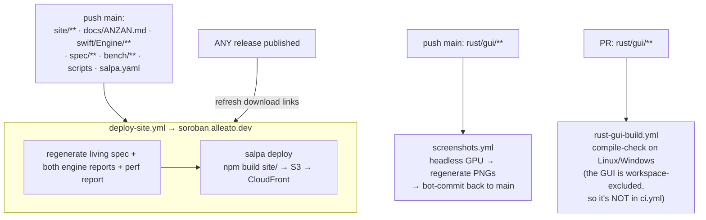

# CI/CD architecture

How the repo's GitHub Actions fit together — the **six workflows**, when each
fires, how conditional jobs are gated, and how the pieces depend on one another.
This is the *mechanics* of the pipeline; the release *process* (versioning,
gitflow, secrets) lives in [RELEASING.md](RELEASING.md), which this complements.

Diagrams are Mermaid — GitHub renders them inline.

## The six workflows at a glance

| Workflow | Fires on | Purpose | Gate? |
|---|---|---|---|
| **[ci.yml](../.github/workflows/ci.yml)** | every PR; push to `main` | test the change (Swift · Rust · TS · site) | ✅ the branch-protection gate |
| **[release.yml](../.github/workflows/release.yml)** | push to `main` (`swift/**`·`spec/**`); manual | build + sign + notarize the macOS app → tag `vX.Y.Z` | — |
| **[release-rust.yml](../.github/workflows/release-rust.yml)** | push to `main` (`rust/**`·`spec/**`); manual | build the Rust binaries → tag `rust-vX.Y.Z` | — |
| **[deploy-site.yml](../.github/workflows/deploy-site.yml)** | push to `main` (`site/**`, `docs/ANZAN.md`, …); any release published; manual | build + publish soroban.alleato.dev | — |
| **[screenshots.yml](../.github/workflows/screenshots.yml)** | push to `main` (`rust/gui/**`); manual | regenerate + bot-commit the Rust-app screenshots | — |
| **[rust-gui-build.yml](../.github/workflows/rust-gui-build.yml)** | PR (`rust/gui/**`) | compile-check the excluded GUI on Linux/Windows | — |

Two roles run through almost all of them:
[**salpa**](https://github.com/alleato-llc/salpa) (the house release tool,
pulled from ghcr — it owns test/build/sign/publish so those commands live in
one place, not scattered across YAML) and **path filtering** (a change only
triggers, or only does work in, the parts of the repo it touches).

The **`spec/**` directory is special**: it's the shared behavior oracle all
engines honor, so a `spec/**` change fires *everything* — CI, both release
tracks, and the deploy.

---

## CI — the one required workflow

`ci.yml` is the only workflow wired into branch protection. Its design solves a
specific problem: **conditional jobs on a protected branch**. We want a
site-only PR to *not* spin up a macOS runner — but a required check that never
runs leaves the merge blocked forever. The answer is an **aggregate gate**.

### How the gating actually works

- **`changes`** runs `dorny/paths-filter` and outputs four booleans
  (`swift`/`rust`/`ts`/`site`). Filters (note the `spec` YAML anchor merged into
  the engine jobs, so a spec change re-runs all engines):

  | output | true when the PR touches |
  |---|---|
  | `swift` | `swift/**` · `spec/**` · `ci.yml` |
  | `rust` | `rust/**` · `spec/**` · `ci.yml` |
  | `ts` | `ts/**` · `rust/anzan/**` · `rust/wasm/**` · `spec/**` · `ci.yml` |
  | `site` | `site/**` · `ci.yml` |

- Each suite job carries `needs: changes` + `if: needs.changes.outputs.X == 'true'`.
  If its paths didn't change, the job **skips** — cheap, no runner spun up.

- **`CI passed`** `needs` every suite with `if: always()`, so it runs even when
  suites skipped. It fails only if a dependency's result is `failure` or
  `cancelled`; `skipped` and `success` both pass. It is the **sole required
  status check** on `main`.

### Why an aggregate, not the six suites directly

Branch protection *used* to require the six suite names directly. That
**breaks** on a partial-path PR: a skipped **matrix** job (`cargo test`) never
creates its per-OS contexts (`cargo test (ubuntu-latest)` / `(macos-14)`), so
those required names stay `Expected` forever and the merge is `BLOCKED` — the
exact admin-bypass the consolidation set out to kill. The single always-running
`CI passed` job sidesteps it: one name, always reported, aggregating the rest.

> **Editing `ci.yml`?** A change to the workflow matches *every* filter, so all
> suites run for real on that PR (good — it self-validates). Run `actionlint`
> locally first: `yaml.safe_load` accepts things GitHub's schema rejects (e.g.
> a `${{ }}` expression must use single-quoted strings), and a schema error
> fails the whole run at parse time with **zero** jobs and no useful check.

Concurrency: `group: ci-${{ github.ref }}` + `cancel-in-progress` — a new push
cancels the superseded run.

---

## The release tracks

Two independent, salpa-driven tracks, each **path-gated on push to `main`** (or
manual `workflow_dispatch`). Neither is a required check — they run *after* a
merge and cut a signed release.

- **macOS** (`release.yml`): `test` + `session-tests` (parallel) → `release`
  (`needs: [test, session-tests]`), which runs salpa's sign/notarize/publish and
  tags `vX.Y.Z`. The GitHub Release *is* the point of truth for the signed DMG.
- **Rust** (`release-rust.yml`): `test` → `version` (`needs: test`, computes the
  next `rust-vX.Y.Z` and creates the release) → `build-macos` **and**
  `build-portable` (both `needs: version`) fan out and attach assets.
- salpa derives the next version from the tag history (`version: git`) — see
  [RELEASING.md](RELEASING.md), and the release-doctor skill for the "a green
  run can still ship nothing" failure mode.

A **`spec/** change** touches both tracks' paths → **both** releases fire.

---

## Deploy + auxiliary workflows

- **deploy-site.yml** regenerates the site's *generated* pages first — the
  living spec + the Swift and Rust engine reports (from the shared Gherkin
  features) + the perf report (from `bench/`) — hence it needs Swift, Node, and
  Rust on the one `macos-26` runner, then hands off to `salpa deploy`. It also
  fires on **any release published**, so `src/lib/releases.ts`'s build-time
  download links pick up the fresh binaries.
- **screenshots.yml** runs the GUI's env-gated `SOROBAN_SHOT*` harness under a
  headless software-GPU stack and **commits the PNGs back** (hence
  `contents: write`), so the site's carousel never drifts from the app.
- **rust-gui-build.yml** exists because `rust/gui` is excluded from the cargo
  workspace (it path-depends on the sibling *rime* repo + heavy GPU libs), so it
  can't ride `ci.yml`'s `cargo test`; this compile-checks it per-platform on GUI
  PRs.

---

## Who runs when — the trigger matrix

| A change to… | ci.yml | release.yml | release-rust.yml | deploy-site.yml |
|---|:--:|:--:|:--:|:--:|
| `swift/**` | ✅ | 🚀 | | (if `swift/Engine/**`) 🌐 |
| `rust/**` (not gui) | ✅ | | 🚀 | |
| `rust/gui/**` | (rust-gui-build) | | 🚀 | 🌐 screenshots |
| `ts/**` · `rust/wasm/**` | ✅ | | | |
| `site/**` | ✅ | | | 🌐 |
| **`spec/**`** | ✅ all | 🚀 | 🚀 | 🌐 |
| `docs/ANZAN.md` | | | | 🌐 |
| `docs/**` (other) · `.claude/**` | ✅ (gate reports, suites skip) | | | |

✅ tested · 🚀 released · 🌐 site redeployed. On a PR only `ci.yml` runs; the
release/deploy workflows are `push: main` (or `workflow_dispatch` / `release`).

## The gate contract (one rule to remember)

`main` requires exactly one status check: **`CI passed`**. Everything else is
informational. So: every PR gets a green gate (partial-path PRs skip the
irrelevant suites but still report), nothing red merges without an explicit
admin override, and `main` blocks force-pushes and deletion (which also
protects the release tags' base history).
